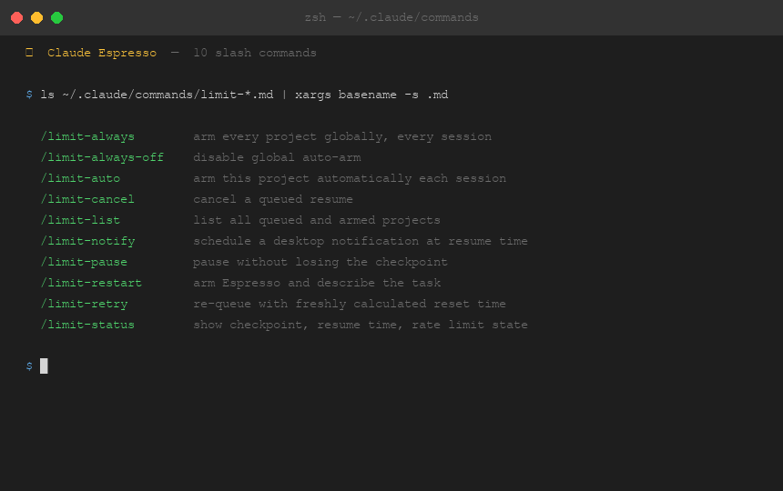
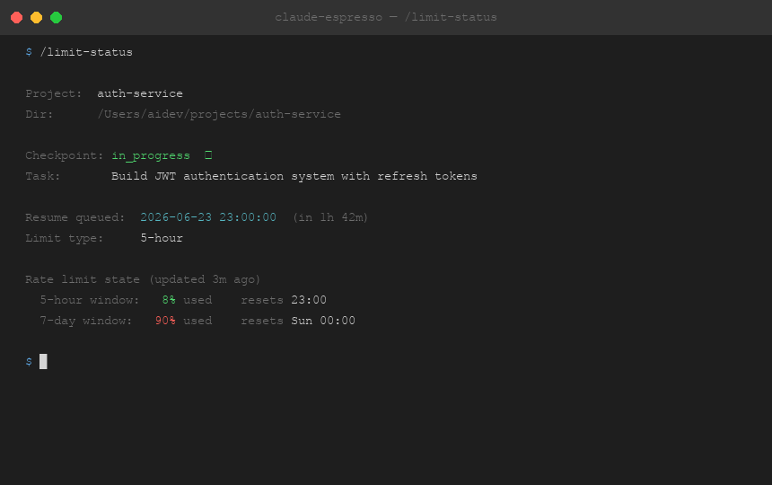
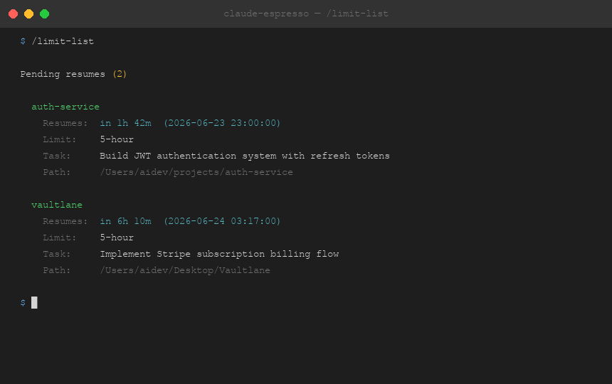
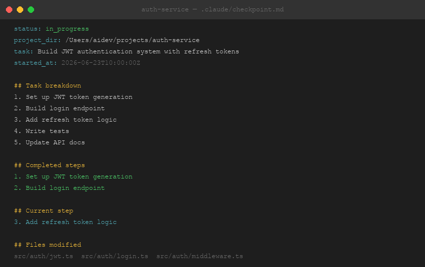
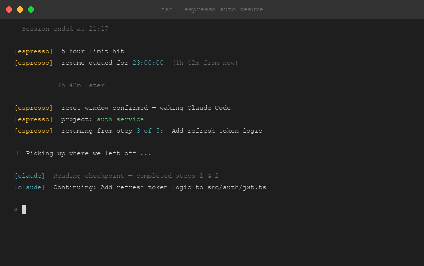

# ☕ Claude Espresso

> Automatically resumes Claude Code when your usage limit resets — no monitoring, no manual restarts.


Give Claude a long task and walk away. If the usage limit hits mid-task, Claude Espresso calculates the exact reset time, waits, and resumes automatically — picking up from the precise step where it left off. No polling, no wrappers, no terminal tricks.

---

## Install

```bash
git clone https://github.com/TimmyAmant/claude-espresso.git
cd claude-espresso
bash install.sh
```

Restart Claude Code to activate the hooks.

**Requirements**

| | macOS | Linux | Windows |
|---|---|---|---|
| [Claude Code](https://claude.ai/code) | ✅ | ✅ | ✅ Git Bash / WSL |
| Python 3 | ✅ built-in | ✅ built-in | ✅ |
| jq | `brew install jq` | `sudo apt install jq` | `winget install jqlang.jq` |

---

## How It Works

Claude Espresso installs three native Claude Code hooks that run silently in the background:

1. **After every response** — a `statusLine` hook reads Claude Code's live rate-limit data and saves the exact 5-hour and 7-day reset timestamps.

2. **When the session ends** — a `Stop` hook cross-references those timestamps with session start time to calculate precisely how long remains on your window, and writes a pending resume file with the exact wakeup time. If you were 3 hours into a 5-hour window, it schedules a resume in **2 hours**, not 5.

3. **In the background** — a scheduler (launchd on macOS, cron on Linux, Task Scheduler on Windows) polls every 15 minutes. The moment your reset time passes, Claude Code relaunches headlessly in your project directory and resumes from the checkpoint.

If Claude hits the limit again mid-resume, the whole cycle repeats until the task is marked complete.

---

## Quick Start

At the start of any long task:

```
/limit-restart
```

Claude asks what you're working on, writes the checkpoint, and starts. You don't need to do anything else — even if the limit hits while you're asleep.

---

## Skills



Claude Espresso adds 10 slash commands. Here's what each one does:

### Core

| Command | Description |
|---|---|
| `/limit-restart` | Arm Espresso — describe the task and Claude writes the checkpoint |
| `/limit-cancel` | Cancel a queued resume and mark the task cancelled |
| `/limit-pause` | Pause without losing the checkpoint — re-arm later with `/limit-restart` |
| `/limit-retry` | Re-queue with a freshly calculated reset time |

### Visibility

| Command | Description |
|---|---|
| `/limit-status` | Show checkpoint status, queued resume time, and live rate-limit percentages |
| `/limit-list` | List every project with a queued or armed resume |

### Notifications

| Command | Description |
|---|---|
| `/limit-notify` | Schedule a macOS desktop notification to fire when the resume is about to happen |

### Auto-arm

| Command | Description |
|---|---|
| `/limit-auto` | Arm this project automatically on every session — no manual `/limit-restart` needed |
| `/limit-always` | Arm every project globally, every session |
| `/limit-always-off` | Disable global auto-arm |

---

## Screenshots

**`/limit-status` — see exactly what's queued and when**



**`/limit-list` — all projects at a glance**



**Checkpoint file — what Claude reads on every resume**



**Auto-resume — what happens when the window resets**



---

## Checkpoint File

Each project gets a `.claude/checkpoint.md` that Claude updates after every significant step. On each resume, Claude reads this file and continues from the exact step it was on.

```
status: in_progress
project_dir: /Users/you/your-project
task: Build the authentication system
started_at: 2026-06-23T12:00:00Z

## Task breakdown
1. Set up JWT token generation
2. Build login endpoint
3. Add refresh token logic
4. Write tests

## Completed steps
1. Set up JWT token generation

## Current step
2. Build login endpoint

## Next step
3. Add refresh token logic

## Files modified
- src/auth/jwt.ts
- src/auth/login.ts

## Notes
Using RS256 per existing codebase convention
resumed_at: 2026-06-23T17:09:02Z
```

Even if the limit hits immediately after a resume, the `resumed_at` timestamp is written first — so there's always a record of the session.

---

## What Gets Installed

**Scripts**

| File | Purpose |
|---|---|
| `~/.claude/scripts/stop-hook.sh` | Fires on every session end — computes exact reset time, queues resume |
| `~/.claude/scripts/statusline-hook.sh` | Fires after every response — saves live reset timestamps |
| `~/.claude/scripts/resume-check.sh` | Runs every 15 min — launches Claude Code when the reset window passes |

**Skills** (`~/.claude/commands/`)

`limit-restart` · `limit-cancel` · `limit-pause` · `limit-retry` · `limit-status` · `limit-list` · `limit-notify` · `limit-auto` · `limit-always` · `limit-always-off`

**System**

| File | Purpose |
|---|---|
| `~/Library/LaunchAgents/com.claude.espresso.plist` | macOS background agent (launchd) |

`~/.claude/settings.json` is updated to wire up the `Stop` and `statusLine` hooks. All existing settings are preserved. Safe to run the installer multiple times.

---

## Pairs Well With

| Skill | Why |
|---|---|
| `/init` | Writes a `CLAUDE.md` for your project — Claude reads it on every resume, so context carries through automatically |
| `/code-review` | Run after a long resumed session to catch anything that drifted across multiple sessions |
| `/schedule` | Handles the timing of scheduled runs; Espresso handles limit hits within each run |

**Recommended workflow:**
1. `/init` — write `CLAUDE.md` once for your project
2. `/limit-restart` — arm Espresso at the start of each major task
3. `/code-review` — verify the work when it finishes

---

## vs. Other Tools

| | Claude Espresso | [autoclaude](https://github.com/henryaj/autoclaude) | [claude-auto-resume](https://github.com/terryso/claude-auto-resume) |
|---|---|---|---|
| Install | `git clone` | Homebrew / Go binary | Shell script |
| Requires tmux | No | Yes | No |
| Wraps `claude` CLI | No | No | Yes |
| Reset time source | Claude's own session data | Parses terminal UI | Watches CLI output |
| Handles weekly limit | Yes | No | No |
| Saves task context | Yes (checkpoint file) | No | No |
| Works in desktop app | Yes | No | No |
| Chains on repeated hits | Yes | Yes | Yes |

---

## Security

When Claude resumes headlessly, it runs with `--dangerously-skip-permissions` — allowing it to read, write, and execute in your project without prompting. This is required for unattended operation.

Only run `/limit-restart` in projects where you're comfortable with Claude operating autonomously. The checkpoint file at `.claude/checkpoint.md` always shows exactly what Claude plans to do next.

---

## Uninstall

```bash
# Remove the background scheduler
launchctl unload ~/Library/LaunchAgents/com.claude.espresso.plist
rm ~/Library/LaunchAgents/com.claude.espresso.plist

# Remove scripts
rm ~/.claude/scripts/stop-hook.sh \
   ~/.claude/scripts/statusline-hook.sh \
   ~/.claude/scripts/resume-check.sh

# Remove skills
rm ~/.claude/commands/limit-restart.md \
   ~/.claude/commands/limit-cancel.md \
   ~/.claude/commands/limit-pause.md \
   ~/.claude/commands/limit-retry.md \
   ~/.claude/commands/limit-status.md \
   ~/.claude/commands/limit-list.md \
   ~/.claude/commands/limit-notify.md \
   ~/.claude/commands/limit-auto.md \
   ~/.claude/commands/limit-always.md \
   ~/.claude/commands/limit-always-off.md
```

Then open `~/.claude/settings.json` and remove the `statusLine` key and the `Stop` entry under `hooks`.

---

## Contributing

PRs welcome. Current gaps:

- **Linux** — cron is wired up but needs real-world testing across distros
- **Windows** — Task Scheduler path via Git Bash needs validation
- **Notifications** — Linux `notify-send` and Windows PowerShell toast paths need testing

---

## License

MIT
